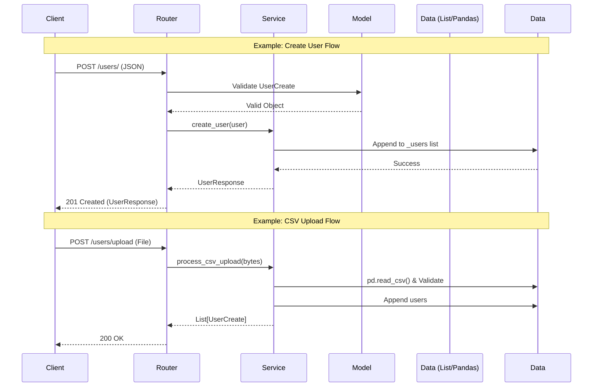

# 專案規格書：RESTful User Management & Analysis Service

## 1. 專案概述 (Project Overview)
本專案旨在建構一個高效能的 RESTful API 伺服器，提供使用者資料的 CRUD 操作、批次 CSV 匯入功能，並利用 Pandas 進行數據分析（分組平均年齡計算）。本系統採用現代化 Python 框架開發，並包含完整的文件規範、單元測試與容器化部署方案。

## 2. 技術堆疊 (Tech Stack)
- 語言: Python 3.10+
- Web 框架: FastAPI (高效能、原生支援 Swagger/OpenAPI)
- 資料處理: Pandas (用於數據分析與 CSV 解析)
- 資料驗證: Pydantic (確保輸入/輸出資料格式嚴謹)
- 測試框架: Unittest
- 容器化: Docker
- API 文件: Swagger UI (自動生成，並包含完整描述與範例)

## 3. 系統架構與目錄結構 (System Architecture)
採用 Router-Service-Model 分層架構，確保職責分離與程式碼可維護性。




```
ai-backend-assessment/
├── app/
│   ├── main.py              # App 入口：Swagger 設定、Middleware、Router 掛載
│   ├── models/              # Data Layer：定義 Pydantic Schemas (含 Example/Desc)
│   │   ├── user_model.py    # UserCreate, UserResponse
│   │   └── api_response.py  # 統一的 API 回應格式
│   ├── routers/             # Controller Layer：處理 HTTP 請求與回應
│   │   └── user_router.py   # 定義 Endpoints (GET, POST, DELETE)
│   ├── services/            # Service Layer：業務邏輯、Pandas 運算、資料庫模擬
│   │   └── user_service.py
│   └── utils/               # 工具層
│       └── file_handler.py  # 處理 CSV 上傳邏輯
├── tests/                   # 測試層
│   └── test_user_creation.py # 針對 User Creation 的 Unit Tests
├── data/
│   └── backend_users.csv    # 測試用資料
├── Dockerfile               # 容器化定義
├── requirements.txt         # 相依套件
└── README.md                # 專案說明與啟動教學
```

## 4. 功能需求與 API 規格 (Functional Requirements)
所有 API 必須在 Swagger UI 上顯示清晰的 Summary、Description 與 Example Value。

### 4.1 使用者管理 (User Management)

#### (1) 建立使用者 (Create User)
- Method: POST
- Endpoint: /users
- 功能: 新增單一使用者，包含姓名與年齡。
- Swagger 規範:
  - Summary: Create a new user.
  - Description: 接收 JSON 格式資料。需驗證 Name 不為空，Age 為合理整數。
  - Example: {"name": "Alice", "age": 30}
- Bonus 驗證:
  - 若 name 為空 -> 回傳 422 Validation Error。
  - 若 age 為 999 -> 回傳 400 Bad Request (模擬特定業務邏輯錯誤)。

#### (2) 刪除使用者 (Delete User)
- Method: DELETE
- Endpoint: /users/{name}
- 功能: 根據姓名刪除特定使用者。
- Swagger 規範:
  - Summary: Delete user by name.
  - Description: 移除指定的 User。若 User 不存在，應回傳 404 Not Found。

#### (3) 查詢使用者列表 (Get Users)
- Method: GET
- Endpoint: /users
- 功能: 取得目前所有已儲存的使用者清單。
- Swagger 規範:
  - Summary: Retrieve all users.
  - Response Example: [{"name": "Alice", "age": 30}, ...]

### 4.2 批次處理與分析 (Batch & Analysis)

#### (4) 批次匯入使用者 (Batch Upload)
- Method: POST
- Endpoint: /users/upload
- 功能: 上傳 CSV 檔案，批次新增使用者。
- 實作細節:
  - 使用 Pandas 或標準庫讀取 CSV Stream。
  - 略過格式錯誤的行或回傳錯誤報告。
- Swagger 規範:
  - Summary: Upload CSV file to batch create users.
  - Content-Type: multipart/form-data

#### (5) 取得分組平均年齡 (Get Average Age)
- Method: GET
- Endpoint: /users/average-age
- 功能: 計算各組使用者的平均年齡。
- 邏輯:
  - 使用 Pandas 套件。
  - 依據 username 的第一個字元進行 Group By。
  - 計算每個 Group 的 age 平均值。
- Swagger 規範:
  - Summary: Calculate average age grouped by the first letter of the name.
  - Example: {"A": 25.5, "B": 30.0}

## 5. 開發任務清單 (Development Task List)
此清單可直接匯入 Antigravity 或 Trello 進行進度追蹤。

### Phase 1: 初始化與架構 (Setup)
- [ ] [Init] 建立 Git Repository 與 .gitignore
- [ ] [Init] 建立專案資料夾結構 (App, Routers, Services)
- [ ] [Env] 設定 Virtual Environment 與 requirements.txt (FastAPI, Pandas, Uvicorn)

### Phase 2: 核心 API 開發 (Core Implementation)
- [ ] [Model] 定義 Pydantic Models (UserCreate) 並加入 Schema Extra (Swagger Examples)
- [ ] [Service] 實作 UserService 類別，使用 List 模擬資料庫
- [ ] [API] 實作 POST /users (Create)
- [ ] [API] 實作 GET /users (List)
- [ ] [API] 實作 DELETE /users/{name} (Delete)

### Phase 3: 資料處理與分析 (Data Processing)
- [ ] [Logic] 實作 CSV 解析邏輯 (File Upload Handler)
- [ ] [API] 實作 POST /users/upload 串接 CSV 處理
- [ ] [Logic] 實作 Pandas GroupBy 計算平均年齡邏輯
- [ ] [API] 實作 GET /users/average-age

### Phase 4: 測試與驗證 (Testing & QA)
- [ ] [Test] 設定 unittest 環境
- [ ] [Test] 撰寫 TC1: 測試 Name 為空字串的情境
- [ ] [Test] 撰寫 TC2: 測試 Age 為 999 的情境
- [ ] [QA] 驗證 Swagger UI 的 Description 與 Example 是否顯示正確

### Phase 5: 部署與交付 (Deployment)
- [ ] [Docker] 撰寫 Dockerfile (建議使用 Multi-stage build 縮小體積)
- [ ] [Doc] 撰寫 README.md (包含如何 Build, Run, 與測試 API)
- [ ] [Demo] 準備 Demo 腳本 (Swagger 操作流程)

## 6. 快速啟動 (Quick Start)
啟動伺服器：
```bash
uvicorn app.main:app --reload
```

執行測試：
```bash
python -m pytest
```

## 7. 容器化部署 (Docker Deployment)
建置 Docker Image：
```bash
docker build -t backend-user-service .
```

執行 Container：
```bash
docker run -p 8000:8000 backend-user-service
```
可以透過 http://localhost:8000/docs 存取 Swagger UI。
