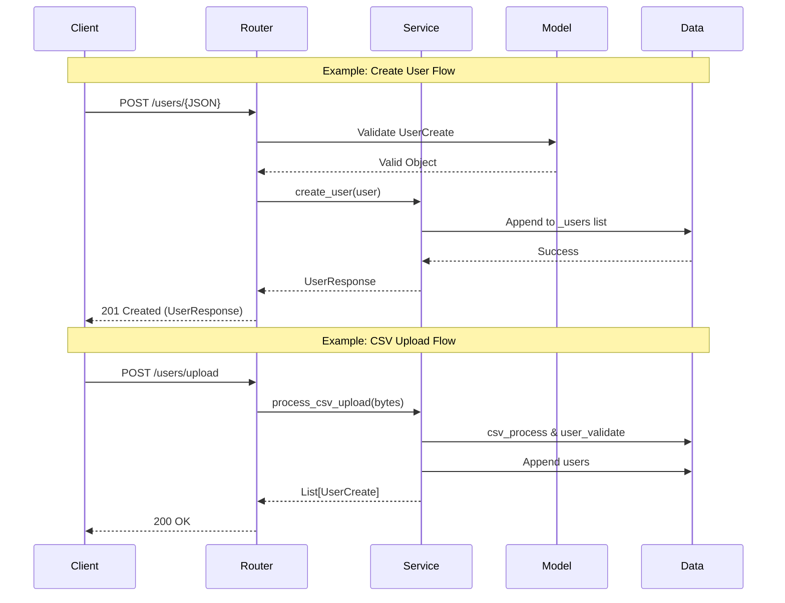

## Overview
建構一個 RESTful API 伺服器，提供外部進行資料的操作，文件包含完整的專案框架、單元測試與容器化部署方案。

## Tech Stack
- Web 框架: FastAPI
- 資料驗證: Pydantic (確保輸入/輸出資料格式嚴謹)
- 測試框架: Unittest
- API 文件: Swagger UI (自動生成，並包含完整描述與範例)

## System Architecture
採用分層架構，模組化使 API 操作有明確的隔離。
```
Backend_Handsome_Practice/
├── app/
│   ├── main.py              # 進入口
│   ├── models/             
│   │   ├── user_model.py    
│   ├── routers/             
│   │   └── user_router.py   
│   └──  services/           
│       └── user_service.py 
├── tests/                  
│   └── test_api.py 
├── data/
│   └── backend_users.csv    
├── Dockerfile             
├── requirements.txt         
└── README.md               
```

- **main.py (Entry Point)**
  - 初始化 FastAPI 應用 (`app`)。
  - 掛載所有路由模組 (`include_router`)。
  
- **models/ (Data Layer)**
  - **user_model.py**:
    - 使用 Pydantic 建立資料結構，便於做資料驗證。
    - `UserCreate`: 定義建立使用者時的輸入欄位驗證 。
    - `UserResponse`: 定義 API 回傳的格式。
    
- **routers/ (Controller Layer)**
  - **user_router.py**: 
    - 定義 API 的 Endpoints，如 `/users/create`，並為每個端點加入詳細描述、異常處理等。
    - 負責接收 HTTP 請求與決定呼叫 service 層中的各式方法。
    
- **services/ (Service Layer)**
  - **user_service.py**:
    - 負責處理所有核心業務邏輯，包含運算、取值等等。
    
- **test/ (Testing)**
  - **test_api.py**: 使用 `unittest` 做單元測試。

## Flow
展示完整的 Client 使用 API 呼叫的流程圖，並只繪製出兩個需要進行資料驗證的 POST API 進行說明，其餘 API 流程相似，僅相差於不需資料驗證。


## API 規格說明
以下說明每個 API 的相關規範與定義，也可以在 Swagger UI 上看到 Summary、Description 等相關定義。
* **Create User (POST)**
    * Endpoint: /users
    * 透過輸入 name 與 age 新增單一使用者。
    * 每次新增前需進行資料驗證:
        * Name 不為空，Age 為 1~120 間的整數。
        * 若有一項驗證錯誤，回傳 422 Validation Error。

* **Delete User (DELETE)**
    * Endpoint: /users/{name}
    * 根據姓名刪除特定使用者，若 User 不存在，回傳 404 Not Found。

* **Get a List of Users (GET)**
    * Endpoint: /users/all
    * 取得目前已加入清單的使用者，回應的是 List，帶有每個使用者資訊。

* **Upload CSV (POST)**
    * Endpoint: /users/upload
    * 上傳 CSV 檔案，一次新增多位使用者，且每位 user 都會做資料驗證。

* **Get Average Age (GET)**
    * Endpoint: /users/average-age
    * 根據使用者資訊分組，並計算各組使用者的平均年齡。


## Quick Start
終端機啟動伺服器：
```bash
uvicorn app.main:app --reload
```

執行測試：
```bash
python -m pytest test/test_api.py
```
Docker Deployment
```bash
docker build -t backend-user-service .  # 建置 Docker Image
docker run -p 8000:8000 backend-user-service
```
Docker 啟動後可以到 http://0.0.0.0:8000/docs 查看 Swagger UI 介面。

